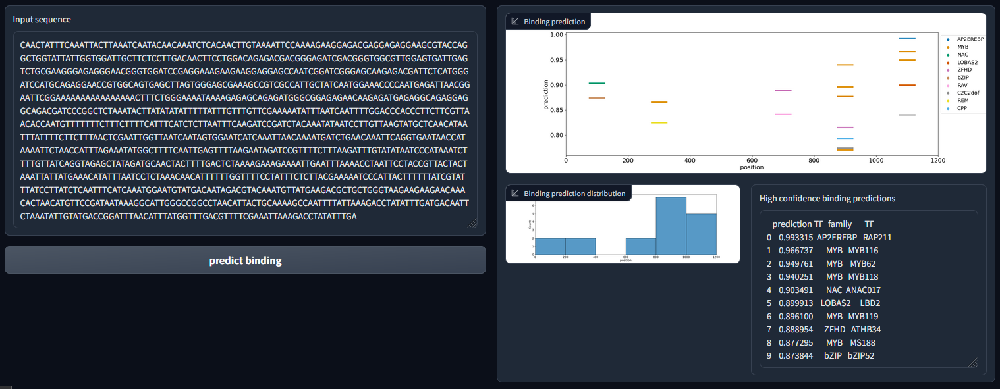

# Plant TF binding prediction

## Background

This app enables the prediction of protein-DNA binding for 217 plant transcription factors on any sequence of interest.
The model architecture was adapted from the publicly available DeepSTARR architecture (de Almeida *et al.*, https://doi.org/10.1038/s41588-022-01048-5). Verified binding sites on unmethylated DNA within 200 base pair windows were taken from an ampDAP-seq experiment (O’Malley *et al.*, https://doi.org/10.1016/j.cell.2016.04.038) to train the models. Training was performed on Arabidopsis thaliana chromosomes 1,2,3 and 5 and testing was performed on the held out chromosome 4. For feature extraction the sequences were one-hot encoded and DNA shape features as well as electrostatic potential was extracted using a publicly available query table (Li *et al.*, https://doi.org/10.1093/nar/gkx1145).

## Usage

Running the script app.py enables opening the app locally. The Sequence of interest can then be inserted in the designated text field.

<p align="center">
  
</p>


## Installation

```
git clone https://github.com/janiksielemann/tf_binding_prediction.git
```

### Required packages:

- pandas (1.3.5)
- numpy (1.21.5)
- matplotlib (3.5.1)
- seaborn (0.11.2)
- tensorflow (2.8.0)
- gradio (3.4.1)
- scikit-learn (1.0.2)

